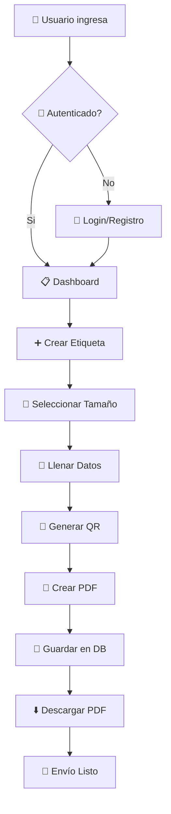
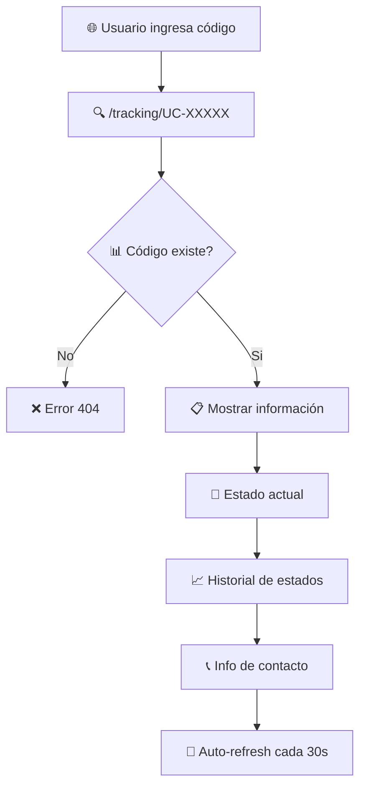
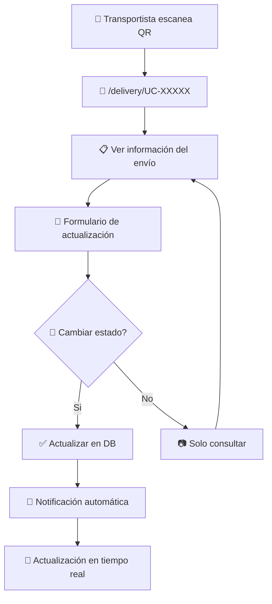
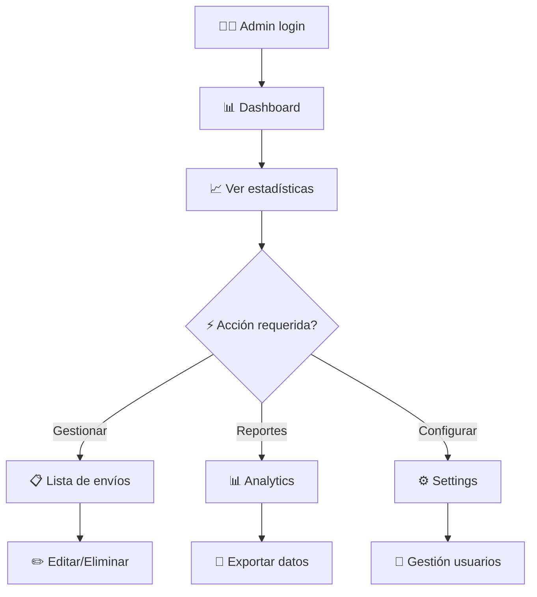
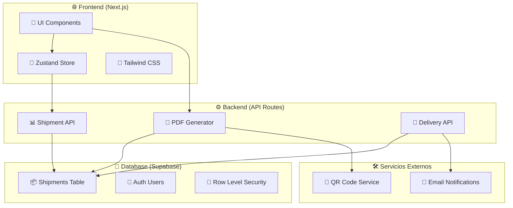
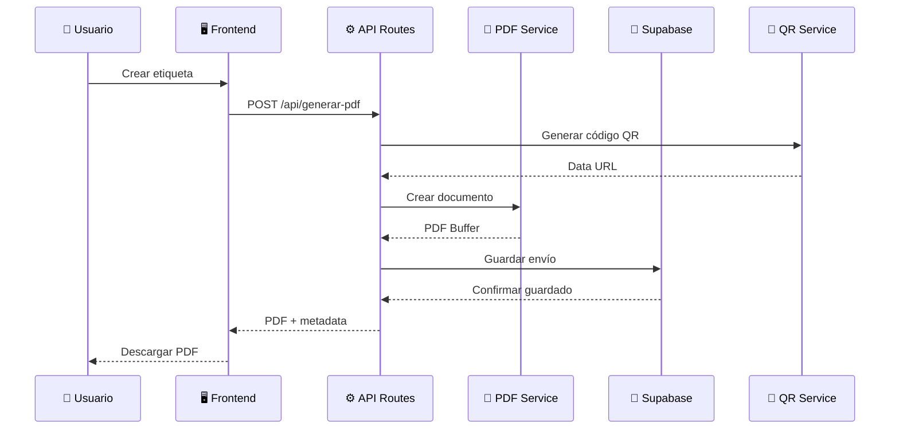

# Urban City Logistics 🚚

Sistema de gestión logística completo para el manejo de envíos, etiquetas y seguimiento de paquetes en tiempo real.

## 📋 Tabla de Contenidos
- [🌟 Características](#-características)
- [🔄 Flujos del Sistema](#-flujos-del-sistema)
- [🛠️ Stack Tecnológico](#️-stack-tecnológico)
- [🚀 Instalación](#-instalación)
- [📁 Estructura del Proyecto](#-estructura-del-proyecto)
- [🎯 Uso del Sistema](#-uso-del-sistema)
- [🔧 API Documentation](#-api-documentation)
- [📈 Posibles Mejoras](#-posibles-mejoras)
- [🚀 Deployment](#-deployment)

## 🌟 Características

### ✅ Gestión de Envíos
- ✨ Creación y gestión de etiquetas de envío
- 📏 Soporte para múltiples tamaños: **10x10cm**, **10x15cm** y **A4**
- 🔢 Generación automática de códigos de seguimiento únicos
- 📝 Información completa del destinatario y remitente
- 💰 Gestión de tipos de pago: PAGADO/COBRAR

### ✅ Sistema de Etiquetas Avanzado
- **🏷️ Etiquetas Pequeñas (10x10 y 10x15)**: Diseño compacto optimizado para paquetes pequeños
- **📄 Etiquetas A4**: Diseño completo con información detallada para envíos importantes
- **📱 Generación PDF**: Sistema robusto usando @react-pdf/renderer (sin dependencias binarias)
- **📱 Códigos QR**: Seguimiento automático integrado con URLs públicas
- **🖨️ Márgenes optimizados**: Configurado para impresión perfecta (30pt de margen)

### ✅ Seguimiento en Tiempo Real
- 📊 Estados de envío actualizables: **Pendiente** → **En tránsito** → **Entregado**
- 🌐 Interfaz pública para seguimiento de paquetes (`/tracking/[codigo]`)
- 📱 Códigos QR escaneables para transportistas
- 📈 Historial completo de estados con timestamps
- 🔄 Actualizaciones en tiempo real

### ✅ Dashboard Administrativo
- 📊 Estadísticas en tiempo real de envíos
- 👤 Gestión de perfiles de usuario con Supabase Auth
- 📋 Vista general de todos los envíos con filtros
- ⚙️ Herramientas de administración completas

## 🔄 Flujos del Sistema

### 🛒 Flujo Principal - Creación de Envío



### 📦 Flujo de Seguimiento - Usuario Final



### 🚛 Flujo de Transportista



### 👨‍💼 Flujo Administrativo



## 🛠️ Stack Tecnológico

### 🎨 Frontend
| Tecnología | Versión | Propósito | ¿Por qué? |
|------------|---------|-----------|-----------|
| **Next.js** | 16.0.1 | Framework React Full-stack | ⚡ App Router, SSR, API Routes integradas |
| **React** | 19.2.0 | Librería UI | 🔄 Componentes reutilizables, hooks modernos |
| **TypeScript** | 5.x | Tipado estático | 🛡️ Prevención de errores, mejor DX |
| **Tailwind CSS** | 4.x | Framework CSS | 🎨 Utility-first, responsive design |

### ⚙️ Backend & Base de Datos
| Tecnología | Propósito | Beneficios |
|------------|-----------|------------|
| **Next.js API Routes** | Backend serverless | 🚀 Deploy fácil, escalable automáticamente |
| **Supabase** | Base de datos PostgreSQL | 📊 Real-time, RLS automático, auth integrada |
| **Supabase Auth** | Autenticación | 🔐 OAuth, magic links, session management |

### 🔧 Librerías Especializadas
| Tecnología | Versión | Uso | Ventaja clave |
|------------|---------|-----|---------------|
| **@react-pdf/renderer** | 4.3.1 | Generación PDFs | 📄 Sin dependencias binarias, deploy en Vercel |
| **qrcode** | 1.5.4 | Códigos QR | 📱 Generación rápida, múltiples formatos |
| **Zustand** | 5.0.8 | Estado global | ⚡ Lightweight, sin boilerplate |
| **SweetAlert2** | 11.26.3 | Alertas UI | 💫 UX superior, customizable |
| **Lucide React** | 0.553.0 | Iconografía | 🎯 Iconos modernos, tree-shaking |

### 🏗️ Arquitectura del Sistema



### 🔄 Flujo de Datos



## 🚀 Instalación

### Prerrequisitos
- Node.js 18+ 
- pnpm (recomendado) o npm

### 1. Clonar el repositorio
```bash
git clone https://github.com/Miguel-Andres/UrbanCity-Logistics.git
cd urbancity-logistics
```

### 2. Instalar dependencias
```bash
pnpm install
```

### 3. Configurar variables de entorno
```bash
cp .env.example .env.local
```

Configurar las siguientes variables:
```env
NEXT_PUBLIC_SUPABASE_URL=tu_supabase_url
NEXT_PUBLIC_SUPABASE_ANON_KEY=tu_supabase_anon_key
NEXT_PUBLIC_SITE_URL=http://localhost:3000
```

### 4. Configurar base de datos
```bash
# Ejecutar migraciones
psql -U postgres -d tu_base_datos -f db/migrations/001_create_shipments.sql
psql -U postgres -d tu_base_datos -f db/migrations/002_configure_rls.sql
```

### 5. Ejecutar el proyecto
```bash
pnpm dev
```

El proyecto estará disponible en `http://localhost:3000`

## 📁 Estructura del Proyecto

```
urbancity-logistics/
├── app/                          # Next.js 13+ App Router
│   ├── api/                     # API Routes
│   │   ├── generar-pdf/        # Generación de PDFs
│   │   ├── shipments/          # Gestión de envíos
│   │   └── delivery/           # Sistema de entrega
│   ├── etiquetas/              # Módulo de etiquetas
│   ├── dashboard/              # Panel administrativo
│   ├── tracking/               # Seguimiento público
│   └── delivery/               # Interface para transportistas
├── components/                  # Componentes reutilizables
├── lib/                        # Utilidades y configuraciones
│   ├── supabase/              # Cliente y configuración
│   ├── stores/                # Estados globales (Zustand)
│   └── types/                 # Definiciones TypeScript
├── db/                         # Base de datos
│   └── migrations/            # Migraciones SQL
└── docs/                       # Documentación
```

## 🎯 Uso

### Crear Etiquetas
1. Navegar a `/etiquetas`
2. Seleccionar tipo de etiqueta (10x10, 10x15, A4)
3. Completar información del envío
4. Generar y descargar PDF

### Seguimiento de Envíos
- **Público**: `/tracking/[codigo]`
- **Transportista**: `/delivery/[codigo]`

### Gestión Administrativa
- **Dashboard**: `/dashboard`
- **Mis Envíos**: `/mis-envios`

## 🔧 API

### Endpoints principales

#### Generación de PDFs
```
POST /api/generar-pdf
Content-Type: application/json

{
  "nombre": "Juan Pérez",
  "telefono": "1234567890",
  "direccion": "Av. Principal 123",
  "localidad": "Buenos Aires",
  "tipoEtiqueta": "10x10",
  "tipoEntrega": "PAGADO",
  "observaciones": "Entregar en horario laboral"
}
```

#### Gestión de Envíos
```
GET /api/shipments        # Listar envíos
POST /api/shipments       # Crear envío
PUT /api/shipments/[id]   # Actualizar envío
DELETE /api/shipments/[id] # Eliminar envío
```

#### Seguimiento
```
GET /api/delivery/[code]  # Obtener información del envío
PUT /api/delivery/[code]  # Actualizar estado del envío
```

## 🏗️ Características Técnicas

### Sistema de PDFs
- **Motor**: @react-pdf/renderer (sin dependencias binarias)
- **Tamaños soportados**: 
  - 10x10cm (283.44 x 283.44 puntos)
  - 10x15cm (283.44 x 425.23 puntos)
  - A4 (595.28 x 841.89 puntos)
- **Márgenes**: 30 puntos (~1cm) para impresión óptima
- **QR Codes**: Integrados con seguimiento automático

### Base de Datos
- **Tabla principal**: `shipments`
- **Row Level Security**: Configurado para multi-tenancy
- **Índices optimizados**: Para búsquedas rápidas por código de seguimiento

### Autenticación
- **Provider**: Supabase Auth
- **Flujo**: OAuth y email/password
- **Protección**: Middleware automático para rutas protegidas

## 🔐 Seguridad

- ✅ Row Level Security (RLS) en Supabase
- ✅ Validación de datos en servidor
- ✅ Sanitización de inputs
- ✅ HTTPS en producción
- ✅ Variables de entorno para secretos

## 🚀 Deployment

### Vercel (Recomendado)
```bash
# Conectar repositorio a Vercel
# Configurar variables de entorno
# Deploy automático en cada push
```

### Variables de entorno en producción
```env
NEXT_PUBLIC_SUPABASE_URL=tu_supabase_url_prod
NEXT_PUBLIC_SUPABASE_ANON_KEY=tu_supabase_anon_key_prod
NEXT_PUBLIC_SITE_URL=https://tu-dominio.com
```

## 📈 Posibles Mejoras

### 🎯 Corto Plazo (1-3 meses)

#### 📱 **Mobile App**
- **React Native** o **Expo** para app móvil nativa
- **Escáner QR** integrado para transportistas
- **Push notifications** para actualizaciones de estado
- **Modo offline** con sincronización posterior

#### 📊 **Analytics Avanzados**
- **Dashboard de métricas** en tiempo real
- **Reportes de rendimiento** por transportista
- **Análisis de rutas** más eficientes
- **KPIs automáticos**: tiempo promedio de entrega, satisfacción

#### 🔔 **Sistema de Notificaciones**
- **Email automático** en cambios de estado
- **SMS notifications** para destinatarios
- **Webhook support** para integraciones externas
- **Templates personalizables** de notificaciones

### 🚀 Mediano Plazo (3-6 meses)

#### 🗺️ **Geolocalización y Mapas**
- **Integración Google Maps** para tracking en vivo
- **Rutas optimizadas** para transportistas
- **Geofencing** para detección automática de entregas
- **Estimación de tiempo** de llegada en tiempo real

#### 💰 **Sistema de Pagos**
- **Stripe integration** para pagos online
- **Mercado Pago** para el mercado argentino
- **Facturación automática** con AFIP
- **Control de cobranzas** y reconciliación

#### 🤖 **Automatización e IA**
- **Chatbot** para consultas de seguimiento
- **Predicción de demanda** con ML
- **Detección automática** de direcciones problemáticas
- **Optimización de rutas** con algoritmos inteligentes

#### 📦 **Inventario y Warehouse**
- **Gestión de stock** en tiempo real
- **Códigos de barras** para productos
- **Picking lists** automatizadas
- **Control de almacén** multinivel

### 🌟 Largo Plazo (6+ meses)

#### 🏢 **Multi-tenancy Completo**
- **Dashboard por empresa** con branding personalizado
- **Facturación por uso** (SaaS model)
- **API pública** para integraciones B2B
- **White-label solution** para empresas grandes

#### 🌐 **Marketplace de Transportistas**
- **Red de transportistas** independientes
- **Sistema de rating** y reviews
- **Asignación automática** de envíos
- **Competencia de precios** en tiempo real

#### 📈 **Business Intelligence**
- **Data warehouse** con BigQuery/Snowflake
- **Dashboards ejecutivos** con Metabase/Grafana
- **Predicciones de negocio** con ML avanzado
- **Análisis de rentabilidad** por ruta/cliente

#### 🔗 **Integraciones Empresariales**
- **ERP integration** (SAP, Oracle)
- **E-commerce platforms** (Shopify, WooCommerce)
- **Marketplaces** (MercadoLibre, Amazon)
- **API GraphQL** para consultas complejas

### 🛠️ **Mejoras Técnicas**

#### ⚡ **Performance**
- **Redis cache** para consultas frecuentes
- **CDN** para assets estáticos
- **Database indexing** optimizado
- **Query optimization** con explain plans

#### 🔒 **Seguridad**
- **Audit logs** completos
- **2FA** para usuarios administrativos
- **Rate limiting** en APIs
- **Data encryption** en reposo

#### 🧪 **Testing & QA**
- **E2E testing** con Playwright
- **Unit tests** con Jest
- **Load testing** con Artillery
- **CI/CD** con GitHub Actions

#### 📱 **DevEx & Monitoring**
- **Monitoreo APM** con New Relic/DataDog
- **Error tracking** con Sentry
- **Feature flags** con LaunchDarkly
- **Documentation** con Storybook

### 💡 **Ideas Innovadoras**

#### 🌱 **Sostenibilidad**
- **Carbon footprint** tracking por envío
- **Rutas eco-friendly** priorizadas
- **Packaging sostenible** recommendations
- **Offset de carbono** automático

#### 🎯 **Experiencia de Usuario**
- **AR/VR** para preview de paquetes
- **Voice commands** para actualización de estados
- **Gamification** para transportistas
- **Asistente virtual** con IA

## 📊 Monitoreo

### 📈 **Métricas Actuales**
- **Logs**: Integración con Vercel Analytics
- **Errores**: Tracking automático de errores PDF
- **Performance**: Optimización para Core Web Vitals

### 🎯 **Métricas Propuestas**
- **Uptime monitoring**: 99.9% SLA target
- **API response times**: < 200ms average
- **PDF generation**: < 2s per label
- **User satisfaction**: NPS tracking

## 🤝 Contribución

1. Fork el proyecto
2. Crear feature branch (`git checkout -b feature/nueva-funcionalidad`)
3. Commit cambios (`git commit -m 'feat: agregar nueva funcionalidad'`)
4. Push branch (`git push origin feature/nueva-funcionalidad`)
5. Abrir Pull Request

### Convenciones de Commit
- `feat:` Nueva funcionalidad
- `fix:` Corrección de bugs
- `docs:` Cambios en documentación
- `refactor:` Refactorización de código
- `style:` Cambios de formato/estilo

## 📄 Licencia

Este proyecto está bajo la Licencia MIT - ver el archivo [LICENSE](LICENSE) para más detalles.

## 👥 Equipo

- **Miguel Andrés** - Desarrollador Principal - [@Miguel-Andres](https://github.com/Miguel-Andres)

## 📞 Soporte

Para reportar bugs o solicitar nuevas funcionalidades, por favor crear un [issue](https://github.com/Miguel-Andres/UrbanCity-Logistics/issues).

---

⚡ **Built with Next.js, Supabase & ❤️**